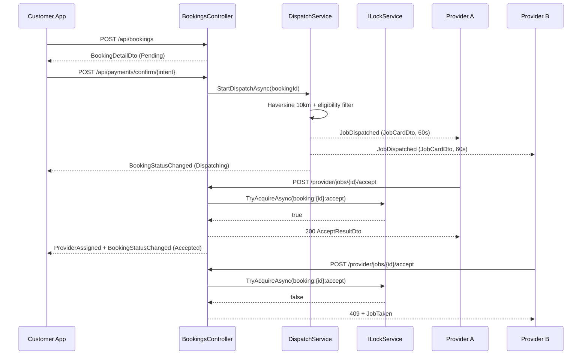

# KHDMA — Implementation Plan
### Real-Time Dispatch, Chat, Live Tracking & Provider Earnings

| | |
|---|---|
| **Version** | 1.0 |
| **Status** | Approved for implementation |
| **Backend** | .NET 9 — Clean Architecture (`KHDMA.sln`) |
| **Mobile** | Flutter 3.x — `D:\Flutter\khedma` |
| **Related** | [`API_CONTRACTS.md`](./API_CONTRACTS.md) · [`ARCHITECTURE_REVIEW.md`](./ARCHITECTURE_REVIEW.md) · `SRS_OnDemand_Service_Platform_v2.docx` |

---

## 1. Purpose & Context

The backend today implements the **admin and identity half** of the SRS: JWT authentication, profile management, category/service CRUD, and admin dashboards for users, bookings, payments and reviews.

The **customer-and-provider transactional core is missing entirely** — the Uber-style real-time dispatch engine described in SRS §2.2, which is the defining feature of the product.

Meanwhile the Flutter app already contains the **complete UI** for that missing flow: `provider_tracking_screen`, `provider_found_screen`, `track_live_screen`, `almost_done_screen`, `provider_jobs_screen`, and the chat screens. But every one of those screens renders **hardcoded i18n keys with no data layer** — only `features/auth` has a real `data/models` layer, and `core/api/dio_consumer.dart` still points at `https://api.world-apm.com/api`, boilerplate inherited from an unrelated project.

Consequence: **the API contracts do not exist anywhere yet and must be designed, not extracted.** That is why [`API_CONTRACTS.md`](./API_CONTRACTS.md) is a separate, first-class document — the Flutter team is blocked on it.

---

## 2. Decisions Locked In

| Area | Decision | Rationale |
|---|---|---|
| Booking foundation | **In scope as Phase 0** | Nothing else can work without it — see §4 |
| Redis | **Abstracted behind interfaces**, in-memory fallback, selected by config | Team can run and demo without a Redis instance; scale-out ready |
| Google Maps | **Available** — Distance Matrix for ETA | API key provisioned |
| Azure Blob | **Not available** — `IFileStorageService` over local `wwwroot/uploads` | Swap the implementation later, no call-site changes |
| FCM | **Not available** — notifications persist to DB + push over SignalR | SRS §7.4 push channel deferred |
| Scheduler | **`BackgroundService` only** — no Hangfire | Zero new dependencies, no extra DB schema, simple to defend |
| Payment gateway | **Stripe** (already implemented) | Deviates from SRS §6.1 (Paymob) — see §11 |

---

## 3. Task List → Phase Traceability

Every item from the original 24-item task list is accounted for. Nothing is silently dropped.

| # | Task | Phase |
|---|---|---|
| 1, 13 | Define ALL SignalR event names + DTO contracts in `Events.cs` | **1.1** |
| 2 | `BookingHub.cs` skeleton — group join/leave, connection management | **1.2** |
| 3 | Redis backplane config in appsettings + `Program.cs` DI | **1.3** |
| 4 | Complete `BookingHub` — all booking status events pipeline | **2.3** |
| 5 | Dispatch Engine — geospatial query (Haversine / spatial) | **2.1** |
| 6 | Provider eligibility filter | **2.2** |
| 7 | Broadcast job card + 60s countdown | **2.3** |
| 8 | Redis first-accept lock — concurrent-safe | **2.4** |
| 9 | `DispatchService`, `DispatchSettingsDto` (10 km, 60 s) | **2.0, 1.3** |
| 10 | 60s countdown background task | **2.5** |
| 11 | Handle no-provider-found — expand radius → queue → `NoProviderFound` | **2.6** |
| 12 | Full SignalR smoke test — dispatch → accept → EnRoute → Complete → payout | **6.3** |
| 14 | `ChatHub.cs` skeleton — 1:1 scoped to booking | **3.1** |
| 15 | Live location streaming — Provider GPS → Customer group | **3.2** |
| 16 | `ChatHub` offline fallback — store in DB, redeliver on reconnect | **3.1** |
| 17 | Chat image upload, PII filter, auto-lock after Completed/Cancelled | **3.1** |
| 18 | Admin read-all-chats endpoint | **3.1** |
| 19 | Provider earnings API (daily/weekly/monthly) | **4** |
| 20 | Provider wallet balance, `EarningsDto`, `PayoutDto`, `CommissionConfigDto` | **4** |
| 21 | Scheduled booking — dispatch T−30 m, notify T−60 m | **5** |
| 22 | Background job for scheduled dispatch | **5** |
| 23 | DB indexes on `BookingStatus`, `ProviderId`, `CustomerId`, `ScheduledAt` | **6.1** |
| 24 | Integration tests — dispatch → accept → complete → payment | **6.2** |
| — | `GET /api/admin/dashboard/summary` | **2.7** |
| — | `GET /api/services/public` (no-auth browse) | **0.3** |
| — | `PUT /api/location/update`, `GET /api/bookings/{id}/eta` | **3.2** |
| — | Final APK/IPA build | *Flutter-side, out of backend scope* |

---

## 4. Blocking Facts (verified against current code)

These are **not opinions** — each was confirmed by reading the code or the EF model snapshot.

1. **`Booking.ProviderId` is `IsRequired()`.**
   Confirmed in `KHDMA.Infrastructure/Migrations/AppDbContextModelSnapshot.cs`:
   ```csharp
   b.Property<string>("ProviderId").IsRequired().HasColumnType("nvarchar(450)");
   ```
   A `Pending` or `Dispatching` booking has **no provider yet** — by definition. **The dispatch model cannot be stored in the current schema.** This is the single hardest blocker.

2. **There is no customer `BookingsController`.** Bookings exist only via `AppDbSeeder` and the admin-facing `AdminBookingsController`. Nothing can create a booking through the API.

3. **`Notification.BookingId` is a required `Guid`.** Account-level notifications (SRS §7.4: "Account approved", "Account suspended") have no booking and cannot be stored.

4. **All 9 admin controllers have `[Authorize(Roles="Admin")]` commented out** (`Controllers/Admin/*`, `AdminBookingsController.cs:11`, `AdminPaymentsController.cs:12`, `AdminReviewsController.cs:10`); `AdminCategoriesController` and `AdminServicesController` have no attribute at all. New `/api/bookings` and `/api/provider/*` endpoints must scope data by the caller's identity, so authentication has to actually be enforced first.

5. **The Flutter checkout screen shows a `VAT (10%)` line** (`home_almost_done_vat` in `lang/en.json`) that the `Payment` entity does not model.

6. **Commission is hardcoded at 10%** in `KHDMA.Infrastructure/Services/Payment/StripePaymentService.cs:62-63`, while `CommissionSettings` seeds **15%** (`AppDbContext.cs:193-201`) and a whole `CommissionController` exists to manage a value nothing reads.

---

## 5. Phase 0 — Booking Foundation
> **Blocks every other phase.** Must merge first.

### 5.1 Migration `AddBookingLifecycle`

`KHDMA.Domain/Entities/Booking.cs`:
```csharp
public string? ProviderId { get; set; }        // was: string  (NOT NULL)
public Provider? Provider { get; set; }

public DateTime? AcceptedAt   { get; set; }
public DateTime? EnRouteAt    { get; set; }
public DateTime? ArrivedAt    { get; set; }
public DateTime? StartedAt    { get; set; }
public DateTime? CompletedAt  { get; set; }
public DateTime? CancelledAt  { get; set; }

public int       DispatchRoundCount { get; set; }
public double    DispatchRadiusKm   { get; set; }
public DateTime? DispatchDeadline   { get; set; }
public DateTime? ProviderNotifiedAt { get; set; }   // scheduled-booking idempotency
```

`AppDbContext.OnModelCreating` — relax the FK:
```csharp
modelBuilder.Entity<Booking>()
    .HasOne(b => b.Provider).WithMany(p => p.Bookings)
    .HasForeignKey(b => b.ProviderId)
    .IsRequired(false)
    .OnDelete(DeleteBehavior.Restrict);
```

Also in this migration:
- `Notification.BookingId` → `Guid?`
- `Payment` += `ServiceFee decimal`, `VatAmount decimal`
- New entity **`BookingStatusHistory`**
  `{ Id, BookingId, FromStatus, ToStatus, ChangedByUserId, Reason, ChangedAt }`
- `BookingStatus` enum += `Failed`, `NoProviderFound`

> ⚠️ **Append to the end of the enum only.** Existing rows store the *integer* value; inserting a member in the middle silently reassigns the meaning of every historical booking.

### 5.2 Enforce Authorization

Uncomment or add `[Authorize(Roles = "Admin")]` on:
`Controllers/Admin/AdminCategoriesController`, `AdminServicesController`, `AdminCustomersController`, `AdminProvidersController`, `AdminUsersController`, `CommissionController`, plus `AdminBookingsController`, `AdminPaymentsController`, `AdminReviewsController`.
Add `[Authorize]` to `PaymentsController` and `NotificationsController`.

> **Verify admin login still works afterwards.** `AppDbSeeder.cs:44` inserts the admin via `context.Users.Add` and `AdminUserService.CreateAdminAsync` never calls `AddToRoleAsync` — so `AspNetUserRoles` is empty for admins. Role checks currently pass **only** because `AuthService.GenerateTokensAsync:253` writes a role claim derived from the `UserRole` enum. Either add `AddToRoleAsync` in both places, or accept the claim-based approach deliberately and document it.

### 5.3 New Controllers

**`KHDMA.API/Controllers/BookingsController.cs`** — `[Authorize(Roles="Customer")]`

| Method | Route | Returns |
|---|---|---|
| POST | `/api/bookings` | `BookingDetailDto` |
| GET | `/api/bookings?tab=all\|active\|completed\|cancelled&page=&pageSize=` | `PagedResponse<BookingListItemDto>` |
| GET | `/api/bookings/{id}` | `BookingDetailDto` |
| POST | `/api/bookings/{id}/cancel` | `BookingDetailDto` |
| GET | `/api/bookings/{id}/eta` | `EtaDto` *(Phase 3)* |

**`KHDMA.API/Controllers/ProviderJobsController.cs`** — `[Authorize(Roles="Provider")]`

| Method | Route | Returns |
|---|---|---|
| POST | `/api/provider/jobs/{id}/accept` | `AcceptResultDto` *(lock-guarded, Phase 2)* |
| POST | `/api/provider/jobs/{id}/decline` | `ApiResponse<string>` |
| PUT | `/api/provider/jobs/{id}/status` | `BookingDetailDto` |
| GET | `/api/provider/jobs?tab=today\|upcoming\|past` | `PagedResponse<BookingListItemDto>` |
| GET | `/api/provider/dashboard` | `ProviderDashboardDto` |
| PUT | `/api/provider/availability` | `ApiResponse<string>` |

**`KHDMA.API/Controllers/PublicServicesController.cs`** — `[AllowAnonymous]` *(SRS §10.1 permits anonymous service browse)*

| Method | Route | Returns |
|---|---|---|
| GET | `/api/services/public?categoryId=&search=&page=` | `PagedResponse<PublicServiceDto>` |
| GET | `/api/services/public/{id}` | `PublicServiceDetailDto` |
| GET | `/api/categories/public` | `List<PublicCategoryDto>` |
| GET | `/api/providers/{id}/public` | `ProviderPublicProfileDto` |

### 5.4 Booking Creation Rules

In `BookingService.CreateAsync`:
1. Validate the service exists and `IsActive`
2. **Snapshot `Service.FixedPrice` server-side** into `Booking.TotalPrice` — never trust a client-supplied price
3. Compute `ServiceFee`, `VatAmount` (from `Vat:Rate` config), `CommissionAmount` and `ProviderEarning` from **`CommissionSettings`**, not a constant
4. Create the `Payment` row as `Pending`
5. Status `Pending`, `ProviderId = null`
6. Dispatch begins **only after payment confirmation** (SRS §6.1) — wired in Phase 2

**Reuse, don't reinvent:** the `ApiResponse<T>` / `PagedResponse<T>` envelopes in `KHDMA.Domain/Common/`, and the mapping style of `AdminServiceService.MapToDto` (`KHDMA.Infrastructure/Services/Admin/AdminServiceService.cs:190`).

---

## 6. Phase 1 — SignalR Foundation
*(Task items 1, 2, 3, 13)*

Add to `KHDMA.API.csproj`:
```xml
<PackageReference Include="Microsoft.AspNetCore.SignalR.StackExchangeRedis" Version="9.0.*" />
<PackageReference Include="StackExchange.Redis" Version="2.8.*" />
```

### 6.1 `KHDMA.Application/RealTime/Events.cs` — the contract file
> **Ship this first.** The Flutter team is blocked on it. Full payload definitions live in [`API_CONTRACTS.md`](./API_CONTRACTS.md).

```csharp
namespace KHDMA.Application.RealTime;

public static class HubEvents
{
    // ---- server -> provider ----
    public const string JobDispatched        = "JobDispatched";         // JobCardDto
    public const string JobDispatchExpired   = "JobDispatchExpired";    // { bookingId }
    public const string JobTaken             = "JobTaken";              // { bookingId }
    public const string JobCancelled         = "JobCancelled";          // { bookingId, reason }

    // ---- server -> customer ----
    public const string BookingStatusChanged = "BookingStatusChanged";  // BookingStatusEventDto
    public const string ProviderAssigned     = "ProviderAssigned";      // ProviderCardDto
    public const string ProviderLocation     = "ProviderLocation";      // ProviderLocationDto
    public const string NoProviderFound      = "NoProviderFound";       // { bookingId, roundsTried }
    public const string PaymentStatusChanged = "PaymentStatusChanged";  // PaymentStatusEventDto

    // ---- chat, both directions ----
    public const string ReceiveMessage       = "ReceiveMessage";        // ChatMessageDto
    public const string MessageRead          = "MessageRead";           // { bookingId, messageId }
    public const string ChatLocked           = "ChatLocked";            // { bookingId }
    public const string PresenceChanged      = "PresenceChanged";       // { userId, isOnline }
}

public static class HubGroups
{
    public static string Booking(Guid bookingId) => $"booking:{bookingId}";
    public static string User(string userId)     => $"user:{userId}";
    public const  string OnlineProviders         = "providers:online";
}
```

### 6.2 `KHDMA.API/Hubs/BookingHub.cs` — skeleton

Mapped at `/hubs/booking`, decorated `[Authorize]`.

- **`OnConnectedAsync`** — read `ClaimTypes.NameIdentifier` and `ClaimTypes.Role`; join `user:{id}`. Providers whose `AvailabilityStatus == Online` also join `providers:online`. Mark presence via `IPresenceStore`.
- **`OnDisconnectedAsync`** — clear presence; broadcast `PresenceChanged`.
- **`JoinBooking(Guid)` / `LeaveBooking(Guid)`** — **ownership check required**: the caller must be that booking's customer or its assigned provider, otherwise throw `HubException`. Without this any authenticated user can subscribe to any booking's live location.

**JWT over WebSockets.** Browsers cannot set headers on a WS handshake, so the token arrives as a query parameter. Append to the existing `AddJwtBearer` block at `KHDMA.API/Program.cs:31`:

```csharp
options.Events = new JwtBearerEvents
{
    OnMessageReceived = ctx =>
    {
        var token = ctx.Request.Query["access_token"];
        if (!string.IsNullOrEmpty(token) &&
            ctx.HttpContext.Request.Path.StartsWithSegments("/hubs"))
            ctx.Token = token;
        return Task.CompletedTask;
    }
};
```
> The `/hubs` path guard matters — without it, access tokens would be accepted from the query string on *every* endpoint, which is a logging and referrer-leak hazard.

### 6.3 Redis Abstraction

`KHDMA.Application/Interfaces/RealTime/`:
```csharp
public interface ILockService
{
    Task<bool>    TryAcquireAsync(string key, string owner, TimeSpan ttl);
    Task<string?> GetOwnerAsync(string key);
    Task          ReleaseAsync(string key);
}

public interface ILocationStore
{
    Task           SetAsync(string providerId, GeoPoint point, TimeSpan ttl);
    Task<GeoPoint?> GetAsync(string providerId);
}

public interface IPresenceStore
{
    Task<bool> IsOnlineAsync(string userId);
    Task       SetAsync(string userId, bool isOnline);
}
```

Two implementations of each — `Redis*` (StackExchange.Redis) and `InMemory*` (`IMemoryCache` / `ConcurrentDictionary`). Selection in `Program.cs`:

```csharp
var redis = builder.Configuration.GetSection("Redis");
if (redis.GetValue<bool>("Enabled"))
{
    var cs = redis["ConnectionString"]!;
    builder.Services.AddSignalR().AddStackExchangeRedis(cs);
    builder.Services.AddSingleton<ILockService,    RedisLockService>();
    builder.Services.AddSingleton<ILocationStore,  RedisLocationStore>();
    builder.Services.AddSingleton<IPresenceStore,  RedisPresenceStore>();
}
else
{
    builder.Services.AddSignalR();
    builder.Services.AddSingleton<ILockService,    InMemoryLockService>();
    builder.Services.AddSingleton<ILocationStore,  InMemoryLocationStore>();
    builder.Services.AddSingleton<IPresenceStore,  InMemoryPresenceStore>();
}
```

**Dispatch code never references Redis directly** — it depends only on the three interfaces.

### 6.4 Configuration

`appsettings.json` is **gitignored**, and nothing in the repo currently documents the required keys. Add a committed **`appsettings.Example.json`**:

```json
{
  "ConnectionStrings": { "DefaultConnection": "Server=...;Database=KHDMA;..." },
  "Jwt": {
    "Key": "<32+ char secret>", "Issuer": "KHDMA", "Audience": "KHDMA.Client",
    "AccessTokenExpiryMinutes": 15, "RefreshTokenExpiryDays": 30
  },
  "StripeSettings": { "SecretKey": "", "PublishableKey": "" },
  "Redis":      { "Enabled": false, "ConnectionString": "" },
  "GoogleMaps": { "ApiKey": "" },
  "Vat":        { "Rate": 0.10 },
  "Dispatch": {
    "InitialRadiusKm": 10, "MaxRadiusKm": 30, "RadiusIncrementKm": 10,
    "AcceptTimeoutSeconds": 60, "MaxRounds": 3
  },
  "FileUpload": {
    "MaxSizeBytes": 10485760,
    "AllowedExtensions": [ ".jpg", ".jpeg", ".png", ".pdf" ]
  }
}
```
Bind `Dispatch` to a `DispatchSettingsDto` via `IOptions<T>` (task item 9).

---

## 7. Phase 2 — Dispatch Engine
*(Task items 4–11)*

New: `KHDMA.Infrastructure/Services/Dispatch/DispatchService.cs` implementing `IDispatchService`.

### 7.1 Geospatial Query *(item 5)*

Use **Haversine expressed in LINQ** — EF Core translates `Math.Acos`, `Math.Cos`, `Math.Sin`, `Math.Sqrt` and `Math.Pow` to T-SQL, so **no NetTopologySuite dependency and no schema change** are needed. `Provider.CurrentLatitude` / `CurrentLongitude` already exist as `double?`.

Prefilter with a **bounding box first** so the Phase 6 index on `(CurrentLatitude, CurrentLongitude)` is usable — a bare Haversine over the whole table forces a scan:

```csharp
var latDelta = radiusKm / 111.0;
var lngDelta = radiusKm / (111.0 * Math.Cos(lat * Math.PI / 180.0));

var candidates = query
    .Where(p => p.CurrentLatitude  >= lat - latDelta && p.CurrentLatitude  <= lat + latDelta
             && p.CurrentLongitude >= lng - lngDelta && p.CurrentLongitude <= lng + lngDelta)
    .Select(p => new {
        Provider = p,
        DistanceKm = 6371.0 * Math.Acos(
            Math.Cos(lat * Math.PI / 180.0) * Math.Cos(p.CurrentLatitude!.Value * Math.PI / 180.0) *
            Math.Cos((p.CurrentLongitude!.Value - lng) * Math.PI / 180.0) +
            Math.Sin(lat * Math.PI / 180.0) * Math.Sin(p.CurrentLatitude!.Value * Math.PI / 180.0))
    })
    .Where(x => x.DistanceKm <= radiusKm)
    .OrderBy(x => x.DistanceKm);
```

### 7.2 Eligibility Filter *(item 6)*

A provider is dispatch-eligible when **all** hold:

| Condition | Field |
|---|---|
| Approved | `Provider.State == ProviderState.Active` |
| Available | `Provider.AvailabilityStatus == AvailabilityStatus.Online` |
| Offers this service | a `ProviderService` row with `ServiceId == booking.ServiceId && IsActive` |
| Not already working | no booking in `{ Accepted, EnRoute, Arrived, InProgress }` |
| Locatable | `CurrentLatitude` and `CurrentLongitude` are not null |
| Account healthy | `ApplicationUser.Status == Active && !IsDeleted` |

### 7.3 Broadcast + Countdown *(items 4, 7)*

```
Status              = Dispatching
DispatchDeadline    = UtcNow + AcceptTimeoutSeconds
DispatchRoundCount += 1
DispatchRadiusKm    = current radius
```
Send `JobDispatched` (payload `JobCardDto`) to each matching `user:{providerId}` group; send `BookingStatusChanged` to the customer. Write a `BookingStatusHistory` row on **every** transition — that is what makes `GET /api/admin/bookings/{id}/history` real instead of the placeholder it is today (`AdminBookingService.cs:152`).

### 7.4 First-Accept Lock *(item 8)*

```csharp
var won = await _lock.TryAcquireAsync($"booking:{id}:accept", providerId, TimeSpan.FromSeconds(60));
if (!won) return ApiResponse<AcceptResultDto>.Fail("This job was already taken", 409);
```
Winner: assign `ProviderId`, `Status = Accepted`, `AcceptedAt`, history row, provider → `Busy`. Losers get **409** plus a `JobTaken` event.

> **Defence in depth — also guard in the database.** A lock-service failure or a Redis failover must not produce two assigned providers:
> ```sql
> UPDATE Bookings SET ProviderId = @pid, Status = @accepted
> WHERE Id = @id AND ProviderId IS NULL AND Status = 1  -- Dispatching
> ```
> Treat `rowsAffected == 0` as "lost the race", regardless of what the lock said.

### 7.5 Timeout Worker *(item 10)*

`KHDMA.Infrastructure/BackgroundJobs/DispatchTimeoutWorker.cs : BackgroundService` — 5 s tick:
```
bookings WHERE Status == Dispatching AND DispatchDeadline < UtcNow
  -> emit JobDispatchExpired to the round's providers
  -> hand off to §7.6
```
State lives in the `Bookings` table, so the worker is correct across restarts.

### 7.6 No Provider Found *(item 11)*

```
if (DispatchRoundCount < MaxRounds && radius + increment <= MaxRadiusKm)
      radius += RadiusIncrementKm;  re-dispatch (§7.3)
else
      Status = NoProviderFound
      emit NoProviderFound to the customer
      refund via IStripePaymentService.RefundPaymentAsync
```
`IStripePaymentService` already exists (`KHDMA.Application/Interfaces/Services/IStripePaymentService.cs`) — reuse it.

### 7.7 Admin Dashboard Summary

`GET /api/admin/dashboard/summary` → booking counts by status, revenue for today/week/month, commission collected, providers online, pending applications, average dispatch-to-accept seconds.

> Model the aggregation on `AdminPaymentService.GetProviderEarningsSummaryAsync` (`AdminPaymentService.cs:114`) — **but not its implementation**: that method calls `ToListAsync()` before filtering and sums in memory. Aggregate server-side here.

### 7.8 Dispatch Sequence



---

## 8. Phase 3 — Chat & Live Location
*(Task items 14–18)*

### 8.1 `KHDMA.API/Hubs/ChatHub.cs` at `/hubs/chat`

The `ChatMessage` entity already exists and is mapped (`AppDbContext.cs:127`) — no new table needed.

- **`SendMessage(bookingId, text, type)`** → persist → broadcast `ReceiveMessage` to `booking:{id}`
- **Offline fallback *(item 16)*** — persist to the DB **before** broadcasting. `GET /api/chat/{bookingId}/history?page=` replays on reconnect. `IsRead` / `ReadAt` already exist on the entity.
- **PII filter *(item 17)*** — regex on `MessageText` for Egyptian mobile numbers and email addresses; reject with a validation message (SRS §7.3).
- **Auto-lock *(item 17)*** — reject sends when `Booking.Status ∈ { Completed, Cancelled, NoProviderFound }`; emit `ChatLocked`. History stays readable (SRS §7.3: "read-only after completion").
- **Membership check on join** — caller must be the booking's customer or assigned provider.

**Image upload *(item 17)*** — `POST /api/chat/upload-image` via a new **`IFileStorageService`**.

> Extract this from the `SaveFileAsync` method currently **triplicated verbatim** in `AuthService.cs:287`, `ProfileService.cs:229` and `AdminServiceService.cs:179`. All three keep the caller's file extension with **no type whitelist and no size limit**, writing into `wwwroot/uploads/`, which `Program.cs:91` serves via `UseStaticFiles()`. Add the jpg/png/pdf whitelist and 10 MB cap that SRS §10.3 requires. Ship `LocalFileStorageService` now; `AzureBlobFileStorageService` drops in later with no call-site changes.

**Admin transcript *(item 18)*** — `GET /api/admin/chat/{bookingId}/transcript?page=`, `[Authorize(Roles="Admin")]` (SRS §7.3, §9.3).

### 8.2 Location & ETA *(item 15)*

| Method | Route | Role |
|---|---|---|
| PUT | `/api/location/update` | Provider |
| GET | `/api/bookings/{id}/eta` | Customer or assigned Provider |

- Store via `ILocationStore` with a **5-minute TTL** — SRS §7.2 requires that provider location is **never persisted**, only held for active bookings.
- On update, broadcast `ProviderLocation` to `booking:{activeBookingId}` **only** — never to a wider group.
- ETA via `IEtaProvider` → `GoogleMapsEtaProvider` (Distance Matrix; key available) with `HaversineEtaProvider` as fallback when the API errors, is rate-limited, or the key is blank. The fallback keeps the demo working offline.

---

## 9. Phase 4 — Earnings & Wallet
*(Task items 19, 20)*

`KHDMA.API/Controllers/ProviderEarningsController.cs` — `[Authorize(Roles="Provider")]`

| Method | Route | Returns |
|---|---|---|
| GET | `/api/providers/earnings?period=daily\|weekly\|monthly` | `EarningsDto` |
| GET | `/api/providers/wallet` | `WalletDto` |

**Reuse:** extract a shared `IEarningsService` from the existing `AdminPaymentService.GetProviderEarningsSummaryAsync` / `GetProviderEarningsBreakdownAsync`, so the admin view and the provider view compute identically and cannot drift.

Two fixes to fold in here:
- Take the provider id **from the JWT**, and drop the `providerId.Trim('{','}',' ')` hack at `AdminPaymentService.cs:116` and `:139` — a symptom of braced GUIDs leaking in from a caller.
- **Fix the commission bug**: replace the hardcoded `0.1m` at `StripePaymentService.cs:62-63` with a read of `CommissionSettings` (seeded 15%, managed by the existing `CommissionService`). Until this is done, provider payouts are wrong and the entire `CommissionController` is decorative.

---

## 10. Phase 5 — Scheduled Bookings
*(Task items 21, 22)*

`KHDMA.Infrastructure/BackgroundJobs/ScheduledBookingWorker.cs : BackgroundService` — 30 s tick:

```
ScheduledTime - 60m <= UtcNow  AND ProviderNotifiedAt IS NULL
    -> notify candidate providers, set ProviderNotifiedAt

ScheduledTime - 30m <= UtcNow  AND Status == Pending  AND payment is Paid
    -> IDispatchService.StartDispatchAsync(bookingId)
```
`ProviderNotifiedAt` (added in Phase 0) makes the worker idempotent across restarts. Matches SRS §5.3.

---

## 11. Phase 6 — Indexes, Tests, Smoke Test
*(Task items 12, 23, 24)*

### 11.1 Migration `AddDispatchIndexes` *(item 23)*

| Table | Index |
|---|---|
| `Bookings` | `(Status)`, `(ProviderId, Status)`, `(CustomerId, Status)`, `(ScheduledTime)`, `(Status, DispatchDeadline)` |
| `Providers` | `(State, AvailabilityStatus)`, `(CurrentLatitude, CurrentLongitude)` |
| `ProviderServices` | `(ServiceId, IsActive)` |
| `ChatMessages` | `(BookingId, SentAt)` |
| `Payments` | `(BookingId)`, `(PaymentStatus, PaidAt)` |
| `BookingStatusHistory` | `(BookingId, ChangedAt)` |

`(Status, DispatchDeadline)` is what makes the 5-second timeout worker cheap. `(CurrentLatitude, CurrentLongitude)` is what makes the §7.1 bounding box cheap.

### 11.2 Tests *(item 24)*

New `KHDMA.Tests` xUnit project — **none exists today**. `WebApplicationFactory` + EF SQLite in-memory, with `InMemoryLockService` / `InMemoryLocationStore` so **CI needs no Redis**.

1. **Concurrency** — 10 providers `POST /accept` the same booking in parallel → exactly one `200`, nine `409`, exactly one `ProviderId` persisted.
2. **Full lifecycle *(item 12)*** — create → pay → dispatch → accept → EnRoute → Arrived → InProgress → Completed → payout math, asserting SignalR events fired **in order** via a fake `IHubContext`.
3. **Timeout** — no accept within 60 s → radius expands → `NoProviderFound` after `MaxRounds`, refund issued.
4. **Authorization** — a Customer token is rejected (`403`) on every `/api/provider/*` and `/api/admin/*` route.

### 11.3 Manual Smoke Test *(item 12)*

Runs on **one machine** with `Redis:Enabled=false`. Two WebSocket clients (Postman or a small HTML page) — **no Flutter build required**.

1. Provider `provider@test.com` / `Password123!` logs in → `PUT /api/provider/availability` = Online → `PUT /api/location/update` with Cairo coordinates.
2. Customer `customer@test.com` / `Password123!` logs in → `GET /api/services/public` → `POST /api/bookings` for a service the provider offers, within 10 km.
3. `POST /api/payments/intent/{bookingId}` then `/confirm/{intentId}` → dispatch fires. Provider's `/hubs/booking` receives `JobDispatched`; customer receives `BookingStatusChanged: Dispatching`.
4. Provider accepts → customer receives `ProviderAssigned` + `BookingStatusChanged: Accepted`. A second provider accepting receives `409`.
5. Location updates stream `ProviderLocation` to the customer; `GET /api/bookings/{id}/eta` returns Google Maps minutes.
6. Chat both directions over `/hubs/chat`. Kill the customer connection, send from the provider, reconnect → `GET /api/chat/{id}/history` replays the missed message.
7. Status → EnRoute → Arrived → InProgress → Completed. Chat now rejects sends and emits `ChatLocked`.
8. `GET /api/providers/earnings?period=daily` shows net = total − **15%** (not 10%). `GET /api/admin/dashboard/summary` reflects the completed booking.
9. Second booking with no eligible provider online → radius expands over 3 rounds → `NoProviderFound` + refund.

### 11.4 Build & Migrate

```bash
dotnet build KHDMA.sln                       # baseline today: 0 errors, 94 warnings
dotnet ef migrations add AddBookingLifecycle -p KHDMA.Infrastructure -s KHDMA.API
dotnet ef migrations add AddDispatchIndexes  -p KHDMA.Infrastructure -s KHDMA.API
dotnet run --project KHDMA.API               # migrations apply on startup (Program.cs:100)
```

---

## 12. Risks

| Risk | Mitigation |
|---|---|
| Reordering `BookingStatus` breaks historical rows | **Append only.** Existing rows store ints |
| Dispatch code merged before the `ProviderId` migration | Phase 0 is a hard gate — no Phase 2 PR merges first |
| SignalR JWT via query string leaks into logs | Guard on `/hubs` path only (§6.2) |
| Enabling `[Authorize(Roles="Admin")]` locks out admins | `AspNetUserRoles` is empty — verify claim-based role first (§5.2) |
| Redis absent in production but `Enabled=true` | Fail fast at startup with a clear message rather than at first dispatch |
| Google Maps quota exhausted mid-demo | `HaversineEtaProvider` fallback (§8.2) |
| Partial refunds mark the whole payment `Refunded` | Known defect — see [`ARCHITECTURE_REVIEW.md`](./ARCHITECTURE_REVIEW.md) §4 |

---

## 13. Deliberate SRS Deviations
> Confirm these with the supervisor so they read as decisions, not omissions.

| SRS | Specified | Implemented | Note |
|---|---|---|---|
| §6.1 | **Paymob** | **Stripe** | Fully working; Paymob would be a gateway swap behind `IStripePaymentService` |
| §2.1 | CQRS + MediatR, FluentValidation, AutoMapper | Plain services, manual mapping | Simpler to defend; no functional loss |
| §10.2 | BCrypt work factor 12 | ASP.NET Identity PBKDF2 | Identity default — arguably stronger, but the SRS text should be amended |
| §4.1 | Hierarchical category tree | Flat `Category → Service` | `Category` has no `ParentId` |
| §7.4 | FCM push | DB + SignalR only | No Firebase credentials available |
